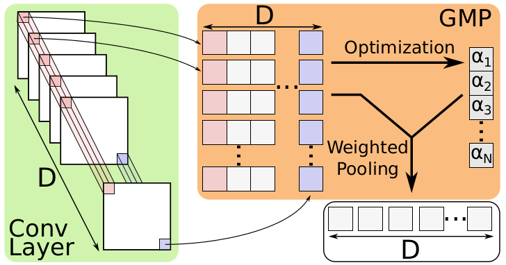

# Deep Generalized Max Pooling (DGMP)

Paper Link: https://arxiv.org/abs/1908.05040

## Abstract:
> Global pooling layers are an essential part of Convolutional Neural Networks
> (CNN). They are used to aggregate activations of spatial locations to produce a
> fixed-size vector in several state-of-the-art CNNs. Global average pooling or
> global max pooling are commonly used for converting convolutional features of
> variable size images to a fix-sized embedding. However, both pooling layer
> types are computed spatially independent: each individual activation map is
> pooled and thus activations of different locations are pooled together. In
> contrast, we propose Deep Generalized Max Pooling that balances the
> contribution of all activations of a spatially coherent region by re-weighting
> all descriptors so that the impact of frequent and rare ones is equalized. We
> show that this layer is superior to both average and max pooling on the
> classification of Latin medieval manuscripts (CLAMM’16, CLAMM’17), as well as
> writer identification (Historical-WI’17).

tldr: Use DGMP as global pooling layer to get some more accuracy

## Results

Average results of 5 runs:

| Method | ICDAR'17 | CLAMM'16 | CLAMM'17 |
|--------|:--------:|:--------:|:--------:|
| Avg    |   69.2   |   85.9   |   81.3   |
| Max    |   69.6   |   85.5   |   81.3   |
| Mixed  |   69.6   |  (82.3)  |  (79.2)  |
| LSE    |   70.0   |  (83.9)  |  (80.4)  |
| DGMP   |   **73.9**   |   **87.1**   |   **83.3**   |

Numbers in brackets are additional results not part of the paper (evaluated after paper submission but with same parameters as the other experiments, i.e. adam w. lr 0.0004, batch size 28, etc.). 

## Requirements
Both code-bases are independent, please see individual folders.

## Run
Have a look at the _scripts_ folders.

Just looking for the pooling layer? -> see _dgmppy_ (note: this differs from the version in clamm/pooling.py because there the l2 normalization is added later, i.e. in _init_model.py_)

## Citation
Please cite the following paper if you found our work useful. Thanks!

_V. Christlein, L. Spranger, M. Seuret, A. Nicolaou, P. Král, A. Maier.
"Deep Generalized Max Pooling." arXiv preprint arXiv:1908.05040 (2019)._

It will be presented soon at the 15th International Conference on Document Analysis and Recognition, Sep. 2019, Sydney, Australia
